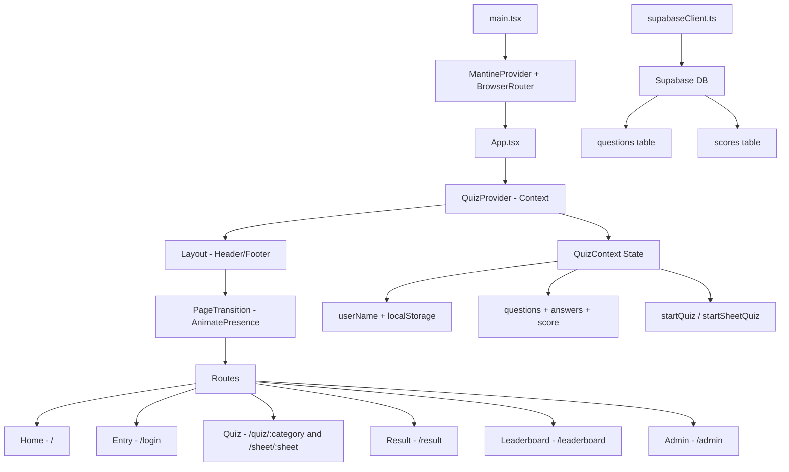

# Quiz Platform — Codebase Review & Improvement Plan

**Date:** 2026-05-14  
**Reviewer:** Architect Mode  
**Scope:** Full codebase review of the Indentify Quiz Platform

---

## Executive Summary

The Indentify Quiz Platform is a React + Vite + TypeScript application using Mantine 7, Supabase, and Framer Motion. It provides category-based and sheet-based quizzes with a leaderboard and admin panel. The Framer Motion animation system (spec & plan already exist) has been implemented well.

The codebase is functional but has **2 critical security vulnerabilities**, several **code quality issues**, **missing infrastructure**, and **UX gaps** that should be addressed. Below is a prioritized improvement plan organized by category.

---

## Architecture Overview



---

## 🔴 CRITICAL — Security Issues

### 1. Hardcoded Admin Password in Client Bundle

**File:** [`Admin.tsx`](src/pages/Admin.tsx:35)  
**Line:** `const ADMIN_PASSWORD = 'hazemezz123123'`

The admin password is hardcoded in client-side source code. Anyone can read it by inspecting the JavaScript bundle in production. This is the most critical issue in the codebase.

**Fix:** Move admin authentication to Supabase. Options:
- **Option A:** Use Supabase Auth with a dedicated admin email/password account. Check `supabase.auth.getUser()` and verify admin role via a `user_roles` table or metadata.
- **Option B:** Create a Supabase RPC function `verify_admin_password` that hashes the password server-side and returns a token. Never expose the password in the frontend.
- **Option C:** Store password in an environment variable `VITE_ADMIN_PASSWORD` — this is still visible in the bundle but at least separates config from code. **This is the minimum viable fix but NOT truly secure.**

**Recommended:** Option A — proper Supabase Auth.

### 2. RLS Policies Allow Anonymous CRUD on All Tables

**File:** [`schema.sql`](schema.sql:38-60)

All RLS policies grant `anon` role full INSERT, UPDATE, DELETE access to the `questions` table. Anyone with the public anon key can:
- Delete all questions
- Modify question answers
- Insert arbitrary data

The `scores` table has no defined RLS policies at all in the schema file.

**Fix:**
- Questions: Only allow SELECT for anon. INSERT/UPDATE/DELETE should require `authenticated` role with admin claims.
- Scores: Allow SELECT for anon, INSERT for authenticated users (after quiz completion), no UPDATE/DELETE for anon.
- Create a `scores` table RLS policy section in `schema.sql`.

---

## 🟠 HIGH — Code Quality Issues

### 3. Duplicate `getDegree` Function

**Files:** [`Result.tsx`](src/pages/Result.tsx:48-58), [`Leaderboard.tsx`](src/pages/Leaderboard.tsx:22-32)

The `getDegree` function is defined identically in both files. This violates DRY and means degree thresholds must be updated in two places.

**Fix:** Extract to a shared utility file, e.g. `src/lib/degrees.ts`, and import in both pages.

### 4. Large Monolithic Component Files

| File | Lines | Issue |
|------|-------|-------|
| [`Admin.tsx`](src/pages/Admin.tsx) | 688 | Contains login gate, dashboard, add form, manage tab, edit modal, table row — all in one file |
| [`Leaderboard.tsx`](src/pages/Leaderboard.tsx) | 339 | Contains degree logic, rank logic, global tab, my scores tab |
| [`Home.tsx`](src/pages/Home.tsx) | 316 | Contains welcome screen, category grid, sheet grid, icon maps |

**Fix:** Extract sub-components:
- `Admin.tsx` → Already has `EditQuestionModal` and `QuestionRow` extracted. Further extract: `AdminLogin`, `AdminDashboard`, `AddQuestionsPanel`, `ManageQuestionsPanel`.
- `Leaderboard.tsx` → Extract: `TopThreeCards`, `GlobalRankingsTab`, `MyScoresTab`.
- `Home.tsx` → Extract: `WelcomeScreen`, `CategoryGrid`, `SheetGrid`, `categoryIcons` map to separate file.

### 5. Inline SVG Icons in Layout Footer

**File:** [`Layout.tsx`](src/components/Layout.tsx:79-108)

The footer uses raw inline SVG markup for heart, GitHub, and LinkedIn icons. The project already uses `lucide-react` as a dependency.

**Fix:** Replace inline SVGs with lucide-react icons: `Heart`, `Github`, `Linkedin`.

### 6. `any` Type Usage in Admin

**File:** [`Admin.tsx`](src/pages/Admin.tsx:96), [`Admin.tsx`](src/pages/Admin.tsx:325-327), [`Admin.tsx`](src/pages/Admin.tsx:337)

Multiple `catch (err: any)` blocks with `err.message` access.

**Fix:** Use typed error handling pattern:
```typescript
catch (err) {
  const message = err instanceof Error ? err.message : 'Operation failed'
  // use message
}
```

### 7. Supabase Client Returns Untyped Data

**File:** [`supabaseClient.ts`](src/lib/supabaseClient.ts:16), [`supabaseClient.ts`](src/lib/supabaseClient.ts:28)

Functions like `fetchCategories` and `fetchQuestionsByCategory` use raw type assertions (`data as Question[]`, `data.map((q: { category: string })`) instead of leveraging Supabase generated types.

**Fix:** Generate Supabase types using `supabase gen types typescript` and import them for proper type safety throughout the data layer.

---

## 🟡 MEDIUM — Architecture & UX Issues

### 8. No 404 / Not Found Route

**File:** [`App.tsx`](src/App.tsx:17-25)

There is no catch-all route. Users navigating to any undefined path see nothing.

**Fix:** Add a `<Route path="*" element={<NotFound />} />` catch-all at the end of the Routes list. Create a simple `NotFound.tsx` page component.

### 9. Navigation Path Inconsistency

Several pages navigate to `/home` but the actual route is `/`:
- [`Quiz.tsx`](src/pages/Quiz.tsx:67): `navigate('/home')`
- [`Quiz.tsx`](src/pages/Quiz.tsx:81): `navigate('/home')`
- [`Result.tsx`](src/pages/Result.tsx:33): `navigate('/home')`
- [`Leaderboard.tsx`](src/pages/Leaderboard.tsx:94): `navigate('/home')`
- [`Admin.tsx`](src/pages/Admin.tsx:451): `navigate('/home')`

**Fix:** Replace all `navigate('/home')` with `navigate('/')` to match the actual route definition.

### 10. Guest Mode UX Confusion

**File:** [`Home.tsx`](src/pages/Home.tsx:170-181)

The welcome screen shows two buttons: "Enter Your Name" and "Or continue as guest" — but both navigate to `/login` which requires a name. There is no actual guest path.

**Fix:** Either:
- Remove the "continue as guest" button and make name entry required.
- Implement true guest mode: auto-generate a guest name like "Guest_1234" and skip the login page.

### 11. No Loading State on Home Page

**File:** [`Home.tsx`](src/pages/Home.tsx:92-99)

Categories and sheets are fetched on mount with no loading indicator. Users see a blank page until data arrives.

**Fix:** Add a `loading` state and show a `Loader` component while fetching, similar to [`Leaderboard.tsx`](src/pages/Leaderboard.tsx:80-87).

### 12. Quiz Skip vs. Next Button Disconnect

**File:** [`Quiz.tsx`](src/pages/Quiz.tsx:280-284)

The quiz shows "Select an answer to continue" hint but the `skipQuestion` function exists in context. The Next button is disabled until an answer is selected, yet skipping is possible through context. The skip functionality is not exposed in the UI clearly.

**Fix:** Add a visible "Skip" button next to the "Next" button for unanswered questions, or auto-advance on skip.

### 13. No React Error Boundary

There is no error boundary component. Runtime errors in any page will crash the entire app with a white screen.

**Fix:** Create an `ErrorBoundary.tsx` component and wrap the app or individual routes. Mantine provides `ErrorBoundary` or a custom one can be built.

### 14. No Route-Based Code Splitting

**File:** [`App.tsx`](src/App.tsx:1-10)

All page components are statically imported. The entire app loads in one bundle.

**Fix:** Use `React.lazy()` + `Suspense` for page-level code splitting:
```typescript
const Home = lazy(() => import('./pages/Home'))
const Quiz = lazy(() => import('./pages/Quiz'))
// etc.
```
This is especially impactful for the Admin page which is rarely visited but is 688 lines.

### 15. No Data Caching Strategy

**File:** [`Home.tsx`](src/pages/Home.tsx:92-99), [`Leaderboard.tsx`](src/pages/Leaderboard.tsx:50-66)

Every navigation to Home or Leaderboard re-fetches all data from Supabase. No caching exists.

**Fix:** Options:
- **Lightweight:** Use `useSWR`-like pattern with stale-while-revalidate via a custom hook.
- **Medium:** Add `react-query` / `tanstack-query` for proper caching, refetching, and stale data management.
- **Minimum:** Cache categories/sheets in QuizContext since they rarely change.

---

## 🔵 LOW — DevOps & Infrastructure

### 16. No Linting Configuration

No ESLint or Prettier configuration exists. Code style consistency relies solely on developer discipline.

**Fix:** Add ESLint with React/TypeScript rules and Prettier. Add `lint` and `format` scripts to `package.json`.

### 17. No Test Framework

No test files, no test runner, no testing configuration.

**Fix:** Add Vitest (matches Vite ecosystem) + React Testing Library. Start with critical path tests:
- Quiz flow: answer selection, score calculation, skip handling
- Admin: authentication gate, CRUD operations
- Context: state transitions

### 18. Missing Scores Table in Schema

**File:** [`schema.sql`](schema.sql)

Only the `questions` table is defined. The `scores` table is referenced in code but has no DDL.

**Fix:** Add `scores` table creation with proper columns, constraints, and RLS policies to `schema.sql`.

### 19. No Database Indexes

Frequently queried columns (`category`, `sheet` on `questions`; `user_name`, `sheet` on `scores`) have no indexes.

**Fix:** Add indexes:
```sql
CREATE INDEX idx_questions_category ON questions(category);
CREATE INDEX idx_questions_sheet ON questions(sheet);
CREATE INDEX idx_scores_user_name ON scores(user_name);
CREATE INDEX idx_scores_sheet ON scores(sheet);
CREATE INDEX idx_scores_percentage ON scores(percentage DESC);
```

### 20. Accessibility — Quiz Options Not Keyboard-Navigable

**File:** [`Quiz.tsx`](src/pages/Quiz.tsx:206-218)

Quiz options are `Card` components with `onClick` handlers. They are not focusable via keyboard and have no ARIA roles.

**Fix:** Make options keyboard-accessible:
- Add `role="radio"` and `aria-checked` to option cards
- Add `tabIndex={0}` and `onKeyDown` for Enter/Space selection
- Wrap the options group in `role="radiogroup"`
- Or replace Cards with proper radio button inputs styled to match the current design

---

## Priority Matrix

| # | Issue | Priority | Effort | Impact |
|---|-------|----------|--------|--------|
| 1 | Hardcoded admin password | 🔴 Critical | Medium | Security |
| 2 | RLS allows anon CRUD | 🔴 Critical | Medium | Security |
| 3 | Duplicate getDegree | 🟠 High | Low | Maintainability |
| 4 | Large monolithic files | 🟠 High | Medium | Maintainability |
| 5 | Inline SVGs in Layout | 🟠 High | Low | Code quality |
| 6 | any type usage | 🟠 High | Low | Type safety |
| 7 | Untyped Supabase data | 🟠 High | Medium | Type safety |
| 8 | No 404 route | 🟡 Medium | Low | UX |
| 9 | Navigation /home vs / | 🟡 Medium | Low | Bug fix |
| 10 | Guest mode confusion | 🟡 Medium | Low | UX |
| 11 | No Home loading state | 🟡 Medium | Low | UX |
| 12 | Skip button missing | 🟡 Medium | Low | UX |
| 13 | No error boundary | 🟡 Medium | Low | Reliability |
| 14 | No code splitting | 🟡 Medium | Low | Performance |
| 15 | No data caching | 🟡 Medium | Medium | Performance |
| 16 | No linting config | 🔵 Low | Low | DevOps |
| 17 | No test framework | 🔵 Low | Medium | DevOps |
| 18 | Missing scores schema | 🔵 Low | Low | Documentation |
| 19 | No database indexes | 🔵 Low | Low | Performance |
| 20 | Accessibility issues | 🔵 Low | Medium | Accessibility |

---

## Recommended Implementation Order

**Phase 1 — Critical Security Fixes:**
1. Fix hardcoded admin password (move to Supabase Auth or env var)
2. Fix RLS policies (restrict anon to SELECT only, require auth for mutations)
3. Add scores table RLS policies

**Phase 2 — Quick Wins:**
4. Extract `getDegree` to shared utility
5. Replace inline SVGs with lucide-react icons
6. Fix navigation `/home` → `/` inconsistency
7. Fix `any` type usage in Admin
8. Add 404 route
9. Add Home page loading state
10. Fix guest mode UX confusion

**Phase 3 — Code Quality:**
11. Generate Supabase types for type-safe data layer
12. Extract sub-components from large files
13. Add React Error Boundary
14. Add route-based code splitting
15. Add quiz Skip button to UI

**Phase 4 — Infrastructure:**
16. Add ESLint + Prettier configuration
17. Add Vitest + React Testing Library
18. Add database indexes to schema.sql
19. Add scores table DDL to schema.sql
20. Add data caching strategy
21. Fix accessibility — keyboard-navigable quiz options